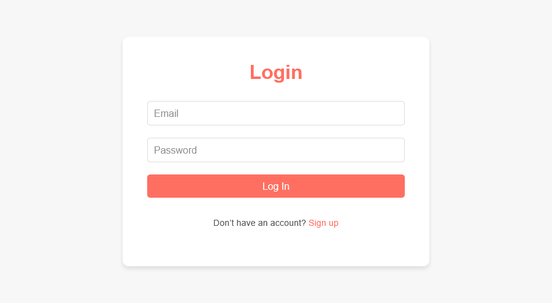

# Habitra – Aplikacja do śledzenia nawyków

## Spis Treści
* [Informacje Ogólne](#informacje-ogólne)
* [Technologie](#technologie)
* [Funkcje](#funkcje)
* [Instalacja](#instalacja)
* [Dodatkowe pliki](#dodatkowe-pliki)
* [Użycie](#użycie)
* [Diagram ERD](#diagram-erd)
* [Schemat architektury](#schemat-architektury)
* [Zrzuty Ekranu](#zrzuty-ekranu)

## Informacje Ogólne
- Habitra to aplikacja webowa umożliwiająca śledzenie nawyków użytkownika, aby wspierać codzienną produktywność i samodyscyplinę.
- Oprócz śledzenia nawyków, aplikacja zawiera listę zadań, która pomaga użytkownikom w organizacji codziennych obowiązków.
- Rozwiązanie ma pomóc użytkownikom w tworzeniu, utrzymywaniu i analizie nawyków, co prowadzi do lepszego zarządzania czasem i osiągania celów.
- Projekt powstał z potrzeby prostego, intuicyjnego narzędzia, które pozwala na monitorowanie postępów w osiąganiu celów.

## Technologie

### 1. Docker
- Izolacja środowisk — każdy serwis (backend, frontend, baza, kolejka) działa w oddzielnym kontenerze
- Powtarzalność — identyczna konfiguracja kontenerów lokalnie i na serwerze

### 2. Symfony (PHP)
- Framework MVC — wyraźny podział na kontrolery, serwisy, encje i repozytoria, co przyspiesza rozwój logiki biznesowej
- Ekosystem bundle’ów — skracają czas integracji funkcji (logowanie, formularze, walidacja)

### 3. PHP (poza workerem RabbitMQ)
- Podstawowy język backendu — cała logika API realizowana jest w PHP
- ORM (Doctrine) — zarządzanie encjami, relacjami i migracje w jednej warstwie, co upraszcza pracę z PostgreSQL

### 4. Worker w Node.js
- Asynchroniczne przetwarzanie — zadania oddelegowane do kolejki RabbitMQ są pobierane i przetwarzane przez workera
- Skalowalność — możliwość uruchomienia wielu instancji workera w Dockerze
- Prosta integracja — pakiet `amqplib` umożliwia szybkie napisanie konsumenta wiadomości AMQP

### 5. RabbitMQ
- Kolejki asynchroniczne — optymalne do zadań bez blokowania API
- Gwarancja dostarczenia — mechanizm `ack/nack` redukuje ryzyko utraty wiadomości
- Integracja z Dockerem — oficjalny obraz z panelem zarządzania (port 15672) ułatwia monitorowanie kolejek

### 6. PostgreSQL
- Relacyjna baza danych z ACID — transakcje i spójność danych (np. przy zapisie nawyków i powiązanych encji)
- Rozszerzenia (JSONB, pełnotekstowe wyszukiwanie) — elastyczność mimo schematu relacyjnego
- Wsparcie w Symfony/Doctrine — automatyczne mapowanie typów Doctrine na typy PostgreSQL, wygodne migracje

### 7. HTTP (REST API)
- Standard komunikacji — wszystkie endpointy Symfony dostępne są przez HTTP/HTTPS
- Bezpieczeństwo — możliwość dodania reverse proxy (Nginx) z SSL/TLS, rate limiting i cache
- Skalowalność — łatwe rozszerzenie o kolejne serwisy lub klientów (np. mobilna aplikacja, CLI)

### 8. React (JSX + CSS)
- Komponentowy model UI — JSX umożliwia deklaratywne budowanie interfejsu, a React dynamicznie aktualizuje widoki
- Zarządzanie stanem — `useState`, `useEffect` (lub Redux/Context) obsługują dane o nawykach, użytkowniku i powiadomieniach
- Modułowość stylów (CSS Modules / Styled Components):
    - Eliminacja kolizji klas i stylów
    - Łatwe zmiany motywu (jasny/ciemny) na podstawie propsów lub stanu

### 9. JWT (JSON Web Tokens)
- Bezstanowa autoryzacja — po zalogowaniu generowany jest token, który klient przechowuje w `localStorage` i przesyła w nagłówku `Authorization: Bearer <token>`
- Integracja w Symfony — LexikJWTAuthenticationBundle zajmuje się tworzeniem, weryfikacją i odświeżaniem tokenów

### 10. ORM (Doctrine)
- Mapowanie obiektowo-relacyjne — encje PHP ⟷ tabele PostgreSQL
- Migracje bazy danych — Doctrine Migrations umożliwiają wersjonowanie zmian schematu.
- Relacje i zapytania DQL — prosty sposób definiowania relacji i wykonywania zaawansowanych zapytań

### 11. CSS / JSX
- **JSX** — składnia łącząca HTML-owe tagi z JavaScriptem, ułatwiająca tworzenie komponentów w React
- **CSS (lub SCSS/SASS):**
    - Definiowanie układu (flexbox, grid), kolorów, marginesów, responsywności
    - CSS Modules lub preprocesor (SASS/SCSS) pozwalają korzystać ze zmiennych, zagnieżdżania i eliminować konflikty nazw

## Funkcje

- **Śledzenie nawyków** — dodawanie nawyków i monitorowanie postępów
- **Lista zadań** — tworzenie i zarządzanie zadaniami wspierającymi codzienne obowiązki
- **Wyszukiwanie zadań** — filtrowanie listy zadań za pomocą słów kluczowych
- **Import zadań z pliku** — dodawanie wielu zadań jednocześnie z pliku
- **Intuicyjny interfejs** — przejrzysty układ zapewniający wygodne użytkowanie
- **Responsywność** — dostosowanie do różnych rozdzielczości ekranu
- **Logowanie i rejestracja** — prosty system uwierzytelniania użytkowników

## Instalacja
### Wymagania
- Zainstalowany Docker oraz Docker Compose
- Przeglądarka obsługująca HTML5
- Zainstalowany OpenSSL

### Kroki instalacji
1. Klonowanie repozytorium
   - W konsoli użyć polecenia `git clone https://github.com/Yuviellia/Habitra.git`
   - Przejść do katalogu poleceniem `cd Habitra`
2. Pierwsze uruchomienie
   - Zlokalizować folder w którym jest zainstalowany OpenSSL i uruchomić plik **start.bat**
     - W konsoli przejść do katalogu głównego projektu
     - Wygenerować certyfikaty poleceniami `openssl genrsa -out config/jwt/private.pem 4096` oraz `openssl rsa -pubout -in config/jwt/private.pem -out config/jwt/public.pem`
     - W katalogu głównym stworzyć plik **.env.local** i wpisać do niego:  
       ```
       JWT_SECRET_KEY=/var/www/html/config/jwt/private.pem
       JWT_PUBLIC_KEY=/var/www/html/config/jwt/public.pem
       JWT_PASSPHRASE={haslo}
       JWT_TOKEN_TTL=3600
       ```
     - Skopiować plik **.env.local** do pliku **.env.test.local**
   - Włączyć docker desktop
   - Uruchomić poleceniem `docker-compose up -d --build`
   - Stworzyć bazę do testów poleceniem `docker-compose exec php php bin/console doctrine:database:create --env=test`
   - Przejść do katalogu z frontendem `cd frontend`
     - Zainstalowac zależności poleceniem `npm install`
     - Uruchomić poleceniem `npm run dev`
3. Uruchomienie aplikacji 
   - Upewnić się że włączony jest docker
   - Uruchomić poleceniem `docker-compose up -d`
   - Przejść do katalogu z frontendem `cd frontend
   - Uruchomić poleceniem `npm run dev`
   - W przeglądarce wejść na `http://localhost:5173`
4. Po uruchomieniu można się zalogować przykładowymi danymi:
   - Email: `j@j.j`, hasło: `j`
   - Email: `h@h.h`, hasło: `h`
5. Dodawanie admina
   - Przejść do katalogu głównego projektu
   - Dostać się do bazy poleceniem `docker exec -it symfony_db psql -U admin -d habitra_database`
   - Utworzyc dane admina poleceniem `INSERT INTO user_details (name, surname, phone) VALUES ('{imie}', '{nazwisko}', '{numer telefonu}');`
   - Zobaczyć jakie id ma wpisany rekord poleceniem `SELECT currval(pg_get_serial_sequence('user_details', 'id'));`
   - Wygenerowac zahashowane haslo w php poleceniem `echo password_hash("{haslo}", PASSWORD_BCRYPT);`
   - Wpisac rekord do bazy `INSERT INTO users (iddetails, email, password, enabled, role, created_at) VALUES ({numer id wygenerowany poleceniem},'{mail}','{zahashowane haslo}',true,'ROLE_ADMIN', NOW());`
6. Uruchamianie testów
   - Uruchomić testy poleceniem `docker exec -it symfony_php php bin/phpunit --testdox`
7. Przeglądanie logów
   - Poleceniem `docker exec -it habitra-node_worker-1 cat /app/bin/worker.log`

## Dodatkowe pliki
- Wyeksportowana baza danych w katalogu głównym: `database.sql`
- Prototyp z Figmy w katalogu `dockument`: `figma.pdf`
- Diagram ERD w katalogu `dockument`: `erd.puml`, `erd.png`
- Schemat architektury w katalogu `dockument`: `schematArchitektury.puml`, `schematArchitektury.png`

## Użycie
#### Użytkownik
1. Niezalogowany użytkownik ma dostęp tylko do strony logowania i rejestracji.
2. Po zalogowaniu użytkownik przechodzi do strony `Habit Tracker`. Użytkownik może:
    - Dodać nowe zadanie wpisując jego nazwę w pole `Add a new task...` oraz zatwierdzając plusem
    - Usunąć zadanie klikająć kosz na śmieci, który pojawia się po najechaniu na nie myszką
    - Zaznaczyć pole przy odpowiednim dniu, żeby zanotować wykonany cel
    - Zmienić tydzień wybierając odpowiednią strzałkę nad tabelą
3. Użytkownik przechodzi do strony `To Do List`, wybierając ją z pasku nawigacji. Użytkownik może:
    - Dodać nową pozycję do listy wpisując jej nazwę w pole `Add a new task...` oraz zatwierdzając plusem
    - Usunąć pozycję klikająć kosz na śmieci, który pojawia się po najechaniu na nią myszką
4. Użytkownik wylogowuje się wybierając `Logout` z paska nawigacji
#### Administrator
1. Niezalogowany użytkownik ma dostęp tylko do strony logowania i rejestracji.
2. Po zalogowaniu administrator przechodzi do strony `Users`. Widzi wszystkich użytkowników zarejestrowanych w aplikacji
3. Administrator wylogowuje się wybierając `Logout` z paska nawigacji

## Diagram ERD


## Schemat architektury


## Zrzuty ekranu
### Rejestracja
  
Ekran rejestracji pozwala użytkownikom na utworzenie nowego konta, wprowadzając podstawowe dane.

### Logowanie

Ekran logowania umożliwia autoryzację użytkowników, pozwalając im na dostęp do swoich danych i funkcji aplikacji po podaniu nazwy użytkownika oraz hasła.

### Śledzenie nawyków
  
Widok śledzenia nawyków, gdzie użytkownik może dodawać nawyki, oznaczać wykonane dni i monitorować swoje postępy.

### Lista zadań
  
Ekran listy zadań, który umożliwia tworzenie i usuwanie zadań.

### Lista użytkowników
  
Ekran listy zadań, który umożliwia przeglądanie użytkowników.
